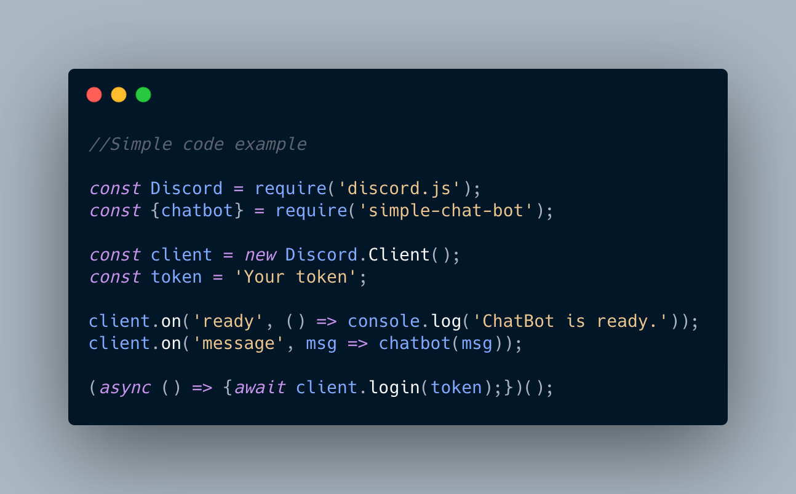

# simple-chat-bot
This is a simple and easy to use chat bot for discord bot devolopers. It works with an api.
</br>

```
//Simple code example

const Discord = require('discord.js')
const { chatbot } = require('simple-chat-bot')

const client = new Discord.Client()
const token = 'Your token'

client.on('ready', () => console.log('ChatBot is ready.'))
client.on('message', (msg) => chatbot(msg))

;(async () => {
  await client.login(token)
})()
```
