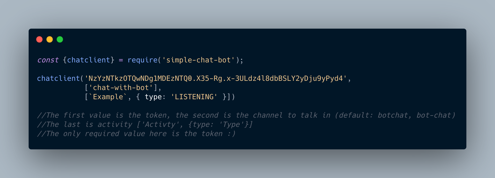
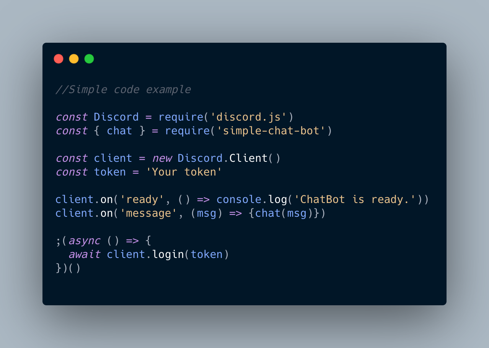

# simple-chat-bot
This is a simple and easy to use chat bot for discord bot devolopers. It works with an api.

You can use this in two ways, as a client or function...
The client looks like this:
<br>


If you want to use it as a function you can use it like this:
<br>

})()
```
